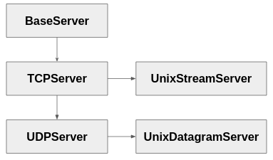

# Clase 16: socketserver

## Introducción: la parte que siempre se repite

En las clases 13 y 14 escribimos varios servidores. Si los mirás juntos, tienen una estructura sospechosamente parecida:

```python
s = socket.socket(...)
s.setsockopt(...)
s.bind(...)
s.listen(...)
while True:
    conn, addr = s.accept()
    # ... acá, y solo acá, cambia lo que hace mi programa
    conn.close()
```

Todo lo que está afuera de esa línea del medio es **siempre igual**. Cambia el protocolo que hablás, cambia la lógica, pero el `bind`/`listen`/`accept`/`close` es idéntico en un servidor de eco, en uno de chat y en uno de archivos.

Cuando un patrón se repite así, hay dos caminos. Uno es copiar y pegar. El otro es que alguien escriba esa parte una vez, la deje fija, y te dé un lugar donde poner lo que cambia.

Eso segundo es un **framework**, y `socketserver` es el que trae Python para esto desde 1994.

La distinción importa más de lo que parece. Con una biblioteca, vos llamás al código de otro. Con un framework, **el framework llama al tuyo**: vos escribís una pieza y él decide cuándo ejecutarla. Se lo conoce como *inversión de control*, y es la diferencia entre `socket` —que es una biblioteca— y lo que vamos a ver hoy.

Esta clase tiene dos objetivos. El primero es práctico: que puedas escribir un servidor correcto en veinte líneas. El segundo es más general, y es el que va a sobrevivir a este módulo: **`socketserver` es un caso de estudio de diseño orientado a objetos**. Herencia usada con criterio, composición mediante mixins, y un patrón —*template method*— que vas a reconocer en FastAPI la clase que viene, en Django, y en cualquier framework que uses después.

> **Nota:** los archivos `eco_tcp.py`, `eco_udp.py`, `comandos.py` y `personalizado.py` acompañan la clase, y cubren lo que sigue en el mismo orden.

---

## Lo mínimo: dónde va tu código

Un servidor de eco completo:

```python
#!/usr/bin/env python3
import socketserver

class Eco(socketserver.BaseRequestHandler):
    def handle(self):
        datos = self.request.recv(1024)
        self.request.sendall(datos.upper())

socketserver.TCPServer(('localhost', 8080), Eco).serve_forever()
```

Cinco líneas, y anda: probalo con `nc localhost 8080`.

Vale la pena detenerse en lo que **no** está. No hay `bind`, no hay `listen`, no hay bucle de `accept`, no hay `close`. Todo eso ocurre adentro de `TCPServer`, y ocurre igual para cualquier servidor que escribas.

Lo único tuyo es la clase `Eco`, y dentro de ella un solo método. Ese es el hueco que el framework te deja para completar.

Dos cosas para tener presentes desde el principio, porque explican casi todo lo que viene después:

**`self.request` es el socket de la conexión con este cliente** — el que devolvió `accept()`, no el socket que escucha. Guardá esa idea: en UDP va a significar algo distinto, y esa asimetría confunde a todo el mundo.

**`handle()` se ejecuta una vez por conexión.** No una vez por servidor, ni una vez por mensaje. Si se conectan tres clientes, corre tres veces; si uno manda diez mensajes sin cerrar, corre una sola vez y adentro tenés que leer diez veces.

---

## Configurar por herencia: una decisión de los 90

Cortá el servidor con Ctrl+C después de que alguien se haya conectado, y relanzalo:

```
OSError: [Errno 98] Address already in use
```

Es el error de la clase 13, por la misma causa: la conexión cerrada quedó en `TIME_WAIT` y el kernel todavía no libera el puerto. La solución conceptual es la misma —`SO_REUSEADDR`— pero la forma de pedirla revela cómo está pensado el módulo:

```python
class Servidor(socketserver.TCPServer):
    allow_reuse_address = True

Servidor(('localhost', 8080), Eco).serve_forever()
```

Para configurar algo no se pasa un parámetro: **se declara una subclase con un atributo de clase**.

Hoy nos resulta raro —lo natural sería `TCPServer(..., reuse_address=True)`— pero tiene una lógica. La configuración se hereda: si armás tu `Servidor` con cinco atributos, cualquier clase que herede de él los recibe. Es configuración como parte de la identidad del tipo, no como argumento de una llamada.

Los cuatro que vas a tocar, y su traducción a lo que escribiste a mano en la clase 13:

| Atributo | Equivale a |
|----------|-----------|
| `address_family` | `AF_INET` en `socket()`; poné `AF_INET6` para IPv6 |
| `socket_type` | `SOCK_STREAM`; no se toca en TCP |
| `allow_reuse_address` | `setsockopt(SO_REUSEADDR, 1)` |
| `request_queue_size` | El argumento de `listen()` |

Un detalle sobre el default: `allow_reuse_address` viene en `False`, y el error solo aparece **si hubo una conexión real antes**. Si nadie se conectó nunca, no hay `TIME_WAIT` y el rebind funciona. Por eso es un problema que no se nota mientras probás y aparece cuando el servidor ya está en uso.

---

## Concurrencia: cambiar una palabra

Levantá el servidor y conectá dos clientes. Escribí en el segundo: no responde hasta que el primero se vaya.

Es el servidor secuencial de la clase 13, con otra ropa. `serve_forever()` atiende una conexión, espera a que `handle()` termine, y recién ahí acepta la siguiente.

En la clase 14 resolvimos esto con threads, y nos costó: crear el `Thread`, decidir si `daemon`, manejar el cierre. Acá:

```python
class Servidor(socketserver.ThreadingTCPServer):
    allow_reuse_address = True
    daemon_threads = True
```

Cambió el nombre de la clase base. Nada más. `handle()` quedó intacto.

Y si preferís procesos:

```python
class Servidor(socketserver.ForkingTCPServer):
    allow_reuse_address = True
```

Eso además **no deja zombies** — el problema que nos ocupó media clase 14. `ForkingMixIn` cosecha los hijos por su cuenta, en un método llamado `collect_children()` que corre en cada conexión nueva.

`daemon_threads = True` merece una línea aparte: sin eso, cortar el servidor con un cliente conectado deja el proceso esperando a que ese cliente termine. Con eso, Ctrl+C corta de una.

Que un cambio tan chico produzca un efecto tan grande no es magia ni casualidad: es consecuencia de cómo está diseñada la jerarquía, y lo vamos a desarmar más adelante. Guardá la pregunta.

---

## El framing vuelve, y esta vez viene resuelto

El eco funciona porque es trivial. Probemos algo apenas más real: recibir comandos línea por línea.

```python
class Comandos(socketserver.BaseRequestHandler):
    def handle(self):
        datos = self.request.recv(1024)          # ¿esto es una línea?
        self.request.sendall(b'recibi: ' + datos)
```

Con alguien tecleando despacio parece andar. Mandale dos comandos de golpe:

```bash
printf 'UNO\nDOS\n' | nc localhost 8080
```

Y vuelve `recibi: UNO\nDOS\n` — los dos juntos, en un solo `recv()`.

Es el problema central de la clase 13: **TCP entrega un flujo de bytes, no mensajes**. `recv(1024)` devuelve lo que haya llegado, que puede ser media línea, una, o tres. Ahí lo resolvimos a mano, con un buffer y un bucle que cortaba por `\n`.

`socketserver` ofrece otro handler que ya lo trae hecho:

```python
class Comandos(socketserver.StreamRequestHandler):
    def handle(self):
        for linea in self.rfile:
            self.wfile.write(b'recibi: ' + linea.strip() + b'\n')
```

`StreamRequestHandler` envuelve el socket en dos objetos tipo archivo —`self.rfile` y `self.wfile`— usando el `makefile()` que vimos en la clase 13. Iterás `rfile` como si fuera un archivo de texto y cada vuelta es una línea completa, sin importar cómo hayan llegado los bytes.

Ahora la salida es la correcta: dos respuestas, una por comando.

Vale una advertencia, y es más seria de lo que parece: **no mezcles `rfile` con `self.request.recv()` en el mismo handler**. `rfile` tiene su propio buffer y se lleva del socket más de lo que le pediste; un `recv()` posterior queda esperando bytes que ya fueron consumidos, y el handler **se cuelga** hasta que venza algún timeout. No da error: se queda quieto, que es peor. Si usás `rfile`, escribí también por `wfile` y no toques `self.request`.

Y una limitación: esto sirve para **protocolos de texto por líneas**. Si tu protocolo usa prefijo de longitud —el framing binario de la clase 13— volvé a `BaseRequestHandler` y leé del socket directamente.

---

## Dónde vive el estado

Hasta acá los servidores no recuerdan nada. Agreguemos algo mínimo: un contador de visitas.

Lo intuitivo:

```python
class Contador(socketserver.StreamRequestHandler):
    n = 0

    def handle(self):
        self.n += 1
        self.wfile.write(f'visita {self.n}\n'.encode())
```

Conectate tres veces y las tres dice **visita 1**.

La explicación es la segunda idea importante del módulo: **el servidor construye un handler nuevo para cada conexión**. Tu objeto nace cuando el cliente llega y muere cuando se va. `self.n += 1` lee el 0 de la clase, guarda un 1 en la instancia, y esa instancia desaparece.

Podés comprobarlo agregando `print(id(self))`: da un número distinto cada vez.

Es un diseño deliberado, no un descuido. Que cada conexión tenga su objeto significa que **no hay estado que se contamine entre clientes**: no podés olvidarte de limpiar una variable y filtrar los datos de uno al siguiente. El precio es que lo que debe persistir hay que ponerlo en otro lado.

Ese otro lado es el servidor, que sí es uno solo, y los handlers lo alcanzan por `self.server`:

```python
class Servidor(socketserver.ThreadingTCPServer):
    allow_reuse_address = True

    def __init__(self, *args, **kwargs):
        super().__init__(*args, **kwargs)
        self.visitas = 0

class Contador(socketserver.StreamRequestHandler):
    def handle(self):
        self.server.visitas += 1
        self.wfile.write(f'visita {self.server.visitas}\n'.encode())
```

Ahora cuenta bien: 1, 2, 3.

### Y con eso volvió la clase 11

Estamos usando `ThreadingTCPServer`, así que cada handler corre **en un thread distinto sobre el mismo objeto servidor**. Y `self.server.visitas += 1` no es una operación atómica: es leer, sumar y guardar. Dos threads pueden leer el mismo valor y escribir el mismo resultado, perdiendo una visita.

Es la race condition de la clase 11, ahora escondida detrás de un framework. La solución también es la de entonces:

```python
import threading

class Servidor(socketserver.ThreadingTCPServer):
    allow_reuse_address = True

    def __init__(self, *args, **kwargs):
        super().__init__(*args, **kwargs)
        self.visitas = 0
        self.lock = threading.Lock()

class Contador(socketserver.StreamRequestHandler):
    def handle(self):
        with self.server.lock:
            self.server.visitas += 1
            n = self.server.visitas          # la lectura también va adentro
        self.wfile.write(f'visita {n}\n'.encode())
```

La lectura va dentro del lock por una razón concreta: si leyeras afuera, otro thread podría incrementar en el medio y le reportarías al cliente un número que no es el suyo.

Hay algo importante en esto que trasciende el módulo: **usar un framework no te exime de entender lo que hay abajo**. El framework te ahorró el `accept()` y el manejo de threads, pero la concurrencia sigue ahí, con todos sus problemas. Si no hubieras cursado la clase 11, este bug te encontraría en producción.

### Con procesos el problema es el opuesto

Si en vez de `ThreadingTCPServer` usás `ForkingTCPServer`, el contador vuelve a fallar — pero por el motivo contrario.

Cada handler corre en un proceso distinto, con su propia copia de memoria heredada por `fork()`. `self.server.visitas += 1` incrementa la copia del hijo, que muere con él. El padre nunca se entera.

No hay lock que arregle eso: no es un problema de sincronización sino de **aislamiento**. Para compartir estado entre procesos hacen falta las herramientas de la clase 9 (`Value`, `Array`, `Manager`), creadas **antes** del fork, o sea en el `__init__` del servidor.

Es la misma disyuntiva de la clase 14 —threads comparten y hay que sincronizar; procesos aíslan y hay que comunicar— reaparecida acá, y elegís una u otra escribiendo un nombre de clase distinto.

---

## Los tres momentos, y qué pasa cuando algo falla

`handle()` no está solo. El framework llama a tres métodos en orden fijo:

```
setup()      preparar     (StreamRequestHandler crea rfile/wfile acá)
handle()     TU CÓDIGO
finish()     limpiar      (flush y cierre de los archivos)
```

La gracia es que `finish()` **se ejecuta aunque `handle()` haya lanzado una excepción**. Es un `finally` puesto por el framework, y es lo que garantiza que los recursos se liberen pase lo que pase.

Podés engancharte en cualquiera de los tres. El caso típico es llevar la cuenta de quién está conectado:

```python
class Handler(socketserver.StreamRequestHandler):
    def setup(self):
        super().setup()                       # imprescindible
        with self.server.lock:
            self.server.activos.add(self.client_address)

    def finish(self):
        with self.server.lock:
            self.server.activos.discard(self.client_address)
        super().finish()
```

El `super()` no es una formalidad: `setup()` de la clase base es el que crea `rfile` y `wfile`. Si lo omitís, tu `handle()` falla con `AttributeError: 'Handler' object has no attribute 'rfile'`.

Esta estructura —la clase base fija el esqueleto y las subclases completan los huecos— es el patrón **template method**. La clase base decide *cuándo* pasa cada cosa; vos decidís *qué* pasa. Es el mecanismo central de cualquier framework, y lo vas a ver otra vez en FastAPI la clase que viene.

### El servidor no se cae

Hagamos que el handler falle a propósito:

```python
class Comandos(socketserver.StreamRequestHandler):
    def handle(self):
        for linea in self.rfile:
            if linea.strip() == b'CRASH':
                raise RuntimeError('explotó')
            self.wfile.write(b'ok\n')
```

Mandale `CRASH`: aparece el traceback en la consola **y el servidor sigue atendiendo**. Conectate de nuevo y funciona.

Eso es `handle_error()`, otro gancho que `BaseServer` provee ya implementado. Su comportamiento por defecto —loguear y continuar— es la decisión correcta para un servidor: que un cliente malicioso o un bug en una petición no tumbe el servicio para todos los demás.

Podés reemplazarlo para loguear a tu manera:

```python
class Servidor(socketserver.ThreadingTCPServer):
    allow_reuse_address = True

    def handle_error(self, request, client_address):
        import traceback
        print(f'[ERROR] {client_address}: {traceback.format_exc().splitlines()[-1]}')
```

En la clase 14 esto lo escribimos a mano, con un `try/except` alrededor de cada cliente. Acá viene puesto.

Hay un tercer gancho que conviene conocer: **`verify_request(request, client_address)`** se llama antes de crear el handler y decide si atender o rechazar. Devolver `False` cierra la conexión sin ejecutar `handle()`. Es el lugar natural para una lista de IPs bloqueadas o un límite de conexiones por cliente.

---

## Mixins: el diseño que hace posible todo lo anterior

Ahora sí, la pregunta que quedó pendiente: **¿cómo puede ser que cambiar el nombre de la clase base agregue concurrencia?**

La respuesta empieza por mirar cuánto código tiene `ThreadingTCPServer`:

```python
class ThreadingTCPServer(ThreadingMixIn, TCPServer):
    pass
```

Ninguno. Es la combinación de dos clases y nada más.

Y el mixin sobrescribe **un solo método**:

```python
class ThreadingMixIn:
    def process_request(self, request, client_address):
        t = threading.Thread(target=self.process_request_thread,
                             args=(request, client_address))
        t.daemon = self.daemon_threads
        t.start()
```

`BaseServer.process_request()` atiende al cliente en el mismo hilo. El mixin lo reemplaza por uno que lanza un thread y vuelve enseguida. Todo lo demás —el `bind`, el `listen`, el `accept`, el ciclo `setup`/`handle`/`finish`— se hereda sin tocar.

Eso es un **mixin**: una clase que aporta un comportamiento acotado y se combina con otras. No tiene sentido por sí sola —instanciar `ThreadingMixIn` no sirve para nada— pero enchufada a un servidor lo vuelve concurrente.

### Por qué esto es buen diseño

Contemos las alternativas. Hay 2 protocolos (TCP, UDP) y 3 modos de concurrencia (secuencial, threads, procesos). Sin mixins harían falta 6 clases completas, cada una repitiendo el código de la otra, y agregar un cuarto modo significaría escribir 2 clases más.

Con mixins hay **4 servidores + 2 mixins = 6 piezas** que se combinan según haga falta. Un modo nuevo es un mixin nuevo, y sirve para los dos protocolos automáticamente.

Pero hay una condición para que esto funcione, y es la lección transferible: **el punto de variación tiene que ser un método identificable**. Si `TCPServer` hiciera el `accept` y el manejo del cliente dentro de una misma función grande, no habría dónde enchufar el mixin. La posibilidad de extender no es gratis: se paga escribiendo métodos chicos, con una responsabilidad cada uno, aunque en el momento parezcan innecesarios.

Cuando diseñes una clase pensada para que otros la extiendan, preguntate dónde va a querer meterse quien la use, y asegurate de que ahí haya un método y no un fragmento en el medio de otro.

### El orden importa, y falla en silencio

```python
class Bien(ThreadingMixIn, TCPServer): pass     # concurrente
class Mal(TCPServer, ThreadingMixIn): pass      # NO concurrente
```

`Mal` **no da ningún error**. Se instancia, arranca, atiende clientes. Simplemente lo hace de a uno, como si el mixin no existiera.

La causa es el MRO (*Method Resolution Order*): Python linealiza la herencia de izquierda a derecha y se queda con el primer método que encuentra.

```
Bien: Bien -> ThreadingMixIn -> TCPServer -> BaseServer -> object
Mal:  Mal  -> TCPServer -> BaseServer -> ThreadingMixIn -> object
```

En `Mal`, `BaseServer` aparece **antes** que el mixin, así que su `process_request` —el secuencial— es el que gana.

Verificalo vos:

```python
for C in (Bien, Mal):
    print(C.__name__, next(k.__name__ for k in C.__mro__ if 'process_request' in k.__dict__))
```

```
Bien -> ThreadingMixIn
Mal  -> BaseServer
```

De ahí la convención universal, que vale para cualquier biblioteca con mixins: **van siempre a la izquierda**. Un mixin modifica comportamiento, y para modificarlo tiene que interceptar antes que la clase base.

Es un bug traicionero porque no se manifiesta como error sino como lentitud, y solo bajo carga.

---

## El mapa completo

Con todo lo anterior, la jerarquía del módulo se lee sola.



`BaseServer` define la interfaz y el ciclo de vida: `serve_forever()`, `handle_request()`, y los ganchos que fuimos usando. De ahí bajan los dos servidores según el protocolo, y cada uno tiene su variante para sockets Unix —la familia `AF_UNIX` de las manijas de la clase 13, que usa una ruta del filesystem en lugar de (IP, puerto).

> Un detalle de la implementación real: en el código de CPython, `UDPServer` hereda de `TCPServer`, no directo de `BaseServer`. Es reutilización de código, no una relación conceptual: aprovecha el manejo del socket y sobrescribe lo que difiere. Verificalo con `socketserver.UDPServer.__bases__`.

Y los mixins se cruzan con esa jerarquía en la otra dimensión:


Dos ejes independientes —protocolo y concurrencia— que se combinan sin duplicar código. Es el mismo principio que separa "qué transporte uso" de "cómo atiendo", y es la razón por la que el módulo envejeció razonablemente bien pese a tener treinta años.

---

## UDP: la misma estructura, una asimetría

Todo lo anterior vale para UDP cambiando la clase base. Pero hay una diferencia que conviene tener presente antes de que te muerda:

```python
class EcoUDP(socketserver.BaseRequestHandler):
    def handle(self):
        datos, sock = self.request           # una TUPLA, no un socket
        sock.sendto(datos.upper(), self.client_address)

socketserver.UDPServer(('localhost', 8080), EcoUDP).serve_forever()
```

**En TCP `self.request` es el socket; en UDP es la tupla `(datos, socket)`.**

Tiene sentido a la luz de la clase 15: en UDP no hay conexión, así que lo que llega no es un canal sino un datagrama suelto. El "request" es ese datagrama más el socket por el cual contestar. Y hay que pasarle `self.client_address` al `sendto()` explícitamente, porque el socket no recuerda a nadie.

Si esa asimetría te molesta, hay un handler que la esconde:

```python
class EcoUDP(socketserver.DatagramRequestHandler):
    def handle(self):
        datos = self.rfile.read()
        self.wfile.write(datos.upper())
```

`DatagramRequestHandler` ofrece `rfile`/`wfile` también para UDP, de modo que el código se parece al de TCP.

Los tres handlers, entonces, según el caso:

| Handler | Cuándo usarlo |
|---------|---------------|
| `BaseRequestHandler` | Protocolo binario, o control total sobre el socket |
| `StreamRequestHandler` | Protocolo de texto por líneas sobre TCP |
| `DatagramRequestHandler` | UDP con la misma comodidad que TCP |

---

## Los límites

`socketserver` es un thread o un proceso por cliente, con **exactamente** los límites que medimos en la clase 14. Para miles de conexiones simultáneas no alcanza, y esa es la clase que viene.

Tampoco tiene TLS integrado —hay que envolver el socket a mano en `server_bind()`—, ni control de backpressure, y la configuración por herencia envejeció frente a los frameworks modernos.

Pero para un servidor interno, una herramienta de línea de comandos o un prototipo, es difícil de superar en relación esfuerzo/resultado. Y la propia biblioteca estándar lo usa: `http.server` está construido enteramente sobre `socketserver`, y `python3 -m http.server` es un `ThreadingHTTPServer` con un handler que habla HTTP.

Ese es, de paso, el mejor ejemplo de uso del framework: `BaseHTTPRequestHandler` hereda de `StreamRequestHandler`, su `handle()` parsea la petición HTTP, y después llama a `do_GET()`, `do_POST()`, etc. O sea, un template method dentro de otro template method.

### Una pista de lo que viene

`serve_forever()` no llama directamente a `accept()`. Hace esto:

```python
with _ServerSelector() as selector:
    selector.register(self, selectors.EVENT_READ)
    while not self.__shutdown_request:
        ready = selector.select(poll_interval)
```

Usa un **selector** para esperar por el socket con timeout, en vez de bloquearse indefinidamente. Eso es lo que le permite responder a un `shutdown()` pedido desde otro thread.

O sea que el mecanismo de la clase 17 ya está adentro de este módulo, usado para vigilar **un** socket. La clase que viene lo usa para vigilar todas las conexiones a la vez, y ahí es donde cambia el modelo de servidor.

---

## Conceptos clave

1. **Un framework invierte el control**: no llamás vos, te llaman a vos.
2. **Tu código va en `handle()`**; el resto lo pone `socketserver`.
3. **`self.request` es el socket en TCP y una tupla en UDP.**
4. **Se crea un handler nuevo por conexión**: el estado no sobrevive ahí, y eso evita contaminación entre clientes.
5. **El estado compartido va en el servidor** (`self.server`).
6. **Con threads hace falta `Lock`; con procesos, las herramientas de la clase 9.** El framework no te exime de entender la concurrencia.
7. **La configuración son atributos de clase**, y por eso se hereda.
8. **`allow_reuse_address` viene en `False`**: activalo.
9. **`StreamRequestHandler` resuelve el framing por líneas** con `rfile`/`wfile`.
10. **`setup()`, `handle()`, `finish()` son un template method**, y `finish()` corre aunque haya excepción.
11. **`handle_error()` evita que un handler roto tumbe el servidor.**
12. **Los mixins sobrescriben `process_request()`**: un método, y cambia el modelo de concurrencia.
13. **El mixin va primero en la herencia**: al revés no falla, no concurre.
14. **`ForkingMixIn` cosecha los hijos solo**: no hay zombies.

---

## Preparación para la próxima clase

En la **clase 17 (I/O Multiplexing)** atacamos el límite que `socketserver` no puede resolver: un thread o proceso por cliente no escala a miles. La respuesta es `select()`, `poll()` y `epoll()` —esperar por muchos sockets a la vez en un solo hilo—, y es la base sobre la que está construido asyncio.

Para llegar preparado:

- Recorré los ejemplos de esta clase escribiéndolos vos, no copiándolos.
- Levantá `comandos.py`, abrí 200 conexiones y contá los threads: `ls /proc/$(pgrep -f comandos)/task | wc -l`. Ese número es el argumento de la clase que viene.

---

## Referencias

- [`socketserver`](https://docs.python.org/3/library/socketserver.html) - documentación oficial
- [Código fuente](https://github.com/python/cpython/blob/main/Lib/socketserver.py) - 800 líneas legibles; empezá por `ThreadingMixIn.process_request`
- [`http.server`](https://docs.python.org/3/library/http.server.html) - el ejemplo canónico de uso del framework
- [Python MRO](https://docs.python.org/3/howto/mro.html) - el algoritmo C3, por qué el orden de los mixins importa
- *Design Patterns* (Gamma et al.) - Template Method, y el principio de composición sobre herencia

---

*Computación II - 2026 - Clase 16*
